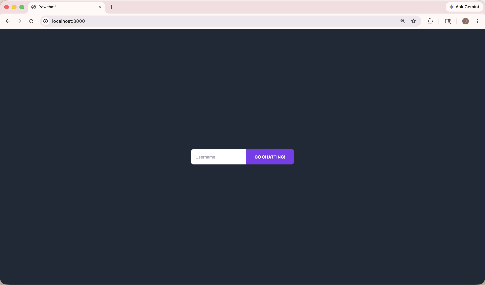
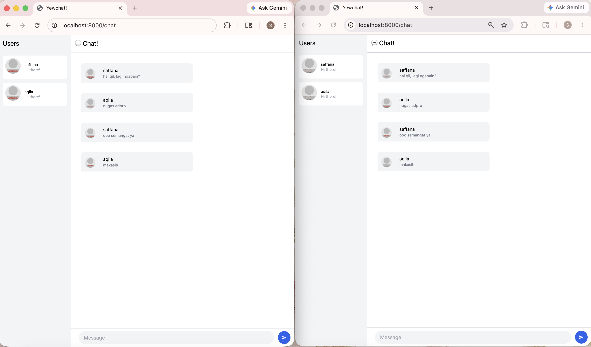
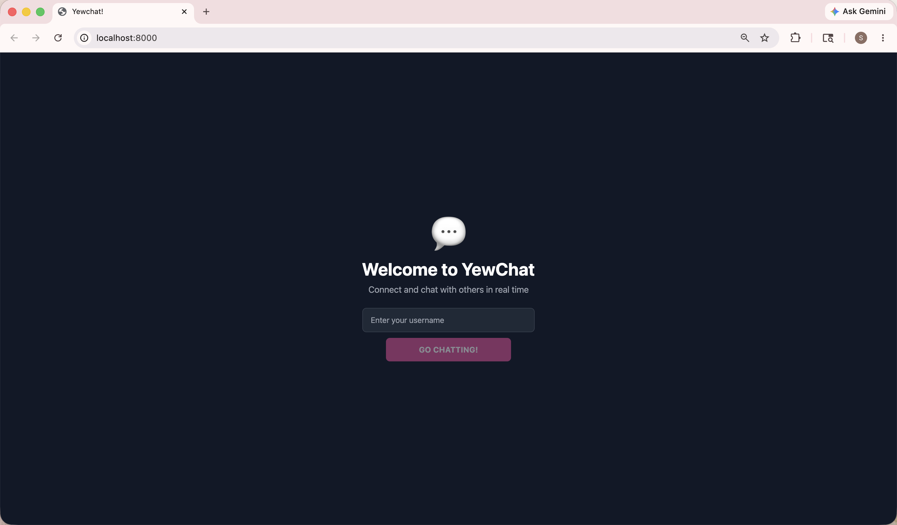
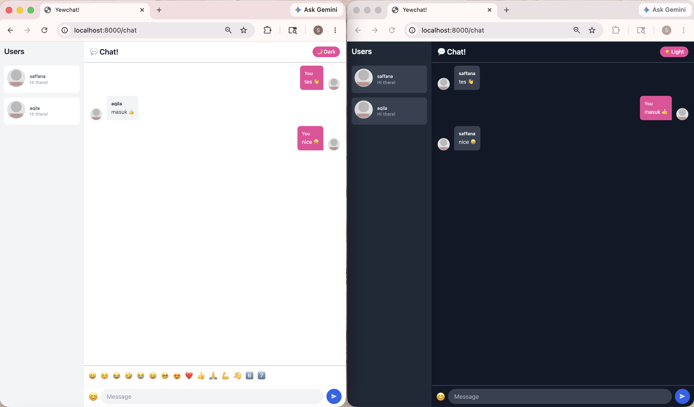

# YewChat 💬

> Source code for [Let’s Build a Websocket Chat Project With Rust and Yew 0.19 🦀](https://fsjohnny.medium.com/lets-build-a-websockets-project-with-rust-and-yew-0-19-60720367399f)

## Install

1. Install the required toolchain dependencies:
   ```npm i```

2. Follow the YewChat post!

## Experiment 3.1: Original Code



## Experiment 3.2: Be Creative!



**1. Message Alignment Based on Sender**

In the original code, all messages regardless of who sent them, were displayed on the left side with the same layout. This made it hard to quickly tell apart our own messages from others.

Fix: When rendering each message, the app now checks whether `m.from` matches the current user's `username` stored in the `Chat` struct. If it matches, the message bubble is aligned to the right using `flex-row-reverse` and styled with a pink background. If it doesn't match, the message stays on the left with a neutral gray background.

**2. Dark Mode and Light Mode Support**

The original UI had a fixed light color scheme. Some users prefer a darker interface, especially in low-light environments.

Fix: A `dark_mode: bool` field was added to the `Chat` struct, toggled by a new `ToggleDarkMode` message. In the `view` function, all background colors, text colors, border colors, and panel colors are determined dynamically based on this flag. A toggle button labeled "🌙 Dark" / "☀️ Light" sits in the chat header.

**3. Emoji Picker**

The original chat only accepted plain text. Adding emoji support makes the conversation more expressive and fun.

Fix: A `show_emoji: bool` field was added to the `Chat` struct, toggled by a new `ToggleEmoji` message. Clicking the 😊 button next to the input bar opens a panel showing a set of emojis. Clicking any emoji triggers `AppendEmoji(String)`, which directly appends it to the current value of the text input via the `NodeRef`.

**4. Enhanced Login Page with Welcome Message**

The original login page was just a bare input field and button centered on a dark background, with no context or greeting for the user.

Fix: The login page was redesigned to include a welcome message. The layout was also changed from a horizontal inline form to a vertical stacked layout with a full-width input and button, making it cleaner.
